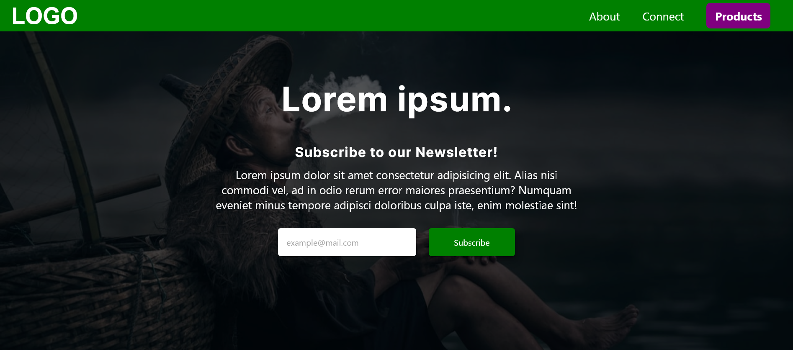

# Responsive-Landing-Page-Example

A responsive landing page example following [Kevin Powell](https://github.com/kevin-powell) video with extra features

## Screenshots

## Features

- Top navbar fully responsive
- Newsletter subscription in hero section
- Better looking footer
- Added smooth shadow to buttons and products

## Bugs

- Footer has too much padding in mobile view
- Products images margin isn't responsive as I like

## 🔗 Links

